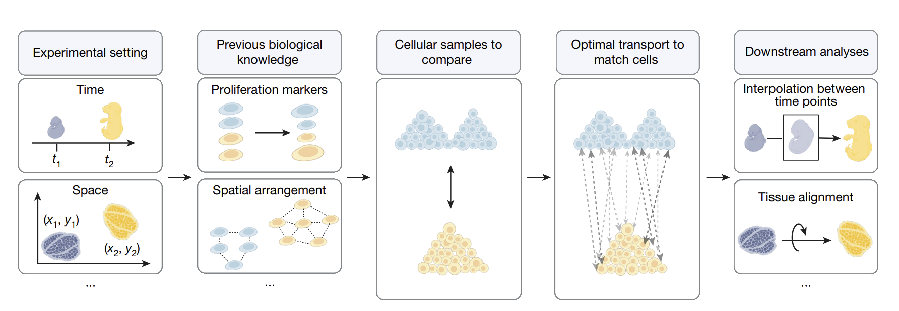
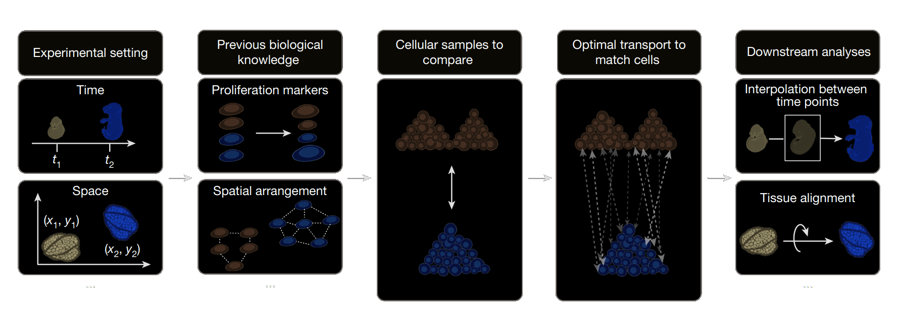

|PyPI| |Downloads| |CI| |Pre-commit| |Codecov| |Docs|

Moscot - Multiomics Single-cell Optimal Transport
=======================================================

**moscot** is a framework for Optimal Transport (OT) applications in
single-cell genomics. It scales to large datasets and can be used for a
variety of applications across different modalities.

moscot's key applications
---------------------------
- Trajectory inference (incorporating spatial and lineage information).
- Mapping cells to their spatial organisation.
- Aligning spatial transcriptomics slides.
- Translating modalities.
- prototyping of new OT models in single-cell genomics.
- ... and more, check out the `documentation <https://moscot.readthedocs.io>`_ for more information.

**moscot** is powered by
`OTT <https://ott-jax.readthedocs.io>`_ which is a JAX-based Optimal
Transport toolkit that supports just-in-time compilation, GPU acceleration, automatic
differentiation and linear memory complexity for OT problems.

Installation
------------
Install :mod:`moscot` by running::

    pip install moscot

In order to install **moscot** from in editable mode, run::

    git clone https://github.com/theislab/moscot
    cd moscot
    pip install -e .

For further instructions how to install jax, please refer to https://github.com/google/jax.

Citing moscot
-------------
If you find a model useful for your research, please consider citing the `Klein et al., 2025`_ manuscript as
well as the publication introducing the model, which can be found in the corresponding documentation.

.. |Codecov| image:: https://codecov.io/gh/theislab/moscot/branch/master/graph/badge.svg?token=Rgtm5Tsblo
    :target: https://codecov.io/gh/theislab/moscot
    :alt: Coverage

.. |PyPI| image:: https://img.shields.io/pypi/v/moscot.svg
    :target: https://pypi.org/project/moscot/
    :alt: PyPI

.. |CI| image:: https://img.shields.io/github/actions/workflow/status/theislab/moscot/test.yml?branch=main
    :target: https://github.com/theislab/moscot/actions
    :alt: CI

.. |Pre-commit| image:: https://results.pre-commit.ci/badge/github/theislab/moscot/main.svg
   :target: https://results.pre-commit.ci/latest/github/theislab/moscot/main
   :alt: pre-commit.ci status

.. |Docs| image:: https://img.shields.io/readthedocs/moscot
    :target: https://moscot.readthedocs.io/en/stable/
    :alt: Documentation

.. |Downloads| image:: https://static.pepy.tech/badge/moscot
    :target: https://pepy.tech/project/moscot
    :alt: Downloads
