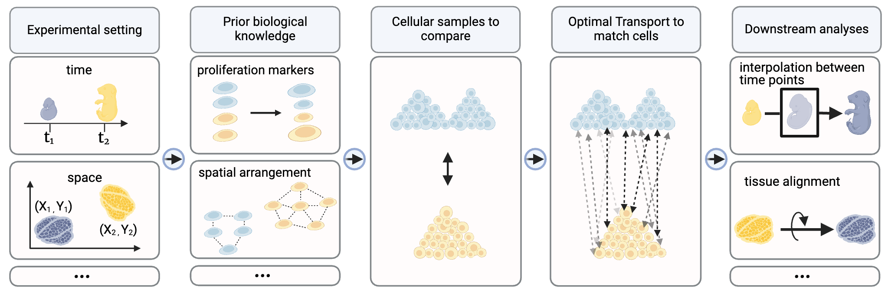
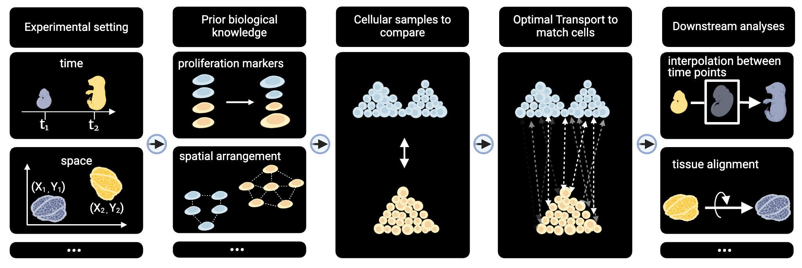

|PyPI| |Downloads| |CI| |Pre-commit| |Codecov| |Docs|

Moscot - Multiomics Single-cell Optimal Transport
=================================================
.. module:: moscot

:mod:`moscot` is a framework for Optimal Transport (OT) applications in
single-cell genomics. It scales to large datsets and can be used for a
variety of applications across different modalities.

Key applications
----------------
- :doc:`Trajectory inference <notebooks/tutorials/200_temporal_problem>`
  (incorporating :doc:`spatial <notebooks/tutorials/500_spatiotemporal>`
  and :doc:`lineage <notebooks/tutorials/100_lineage>` information).
- :doc:`Mapping <notebooks/tutorials/400_spatial_mapping>` cells to their spatial organisation.
- :doc:`Aligning <notebooks/tutorials/300_spatial_alignment>` spatial transcriptomics slides.
- :doc:`Translating <notebooks/tutorials/600_tutorial_translation>` modalities.
- ... and more, check out the :doc:`user guide <user_guide>` for more information.

Getting started
----------------
- Read the :doc:`user guide <user_guide>` to get a high-level overview of :mod:`moscot`.
- Take a look at our :doc:`tutorials <notebooks/tutorials/index>` to learn how to use :mod:`moscot` for data analysis.
- For more technical examples and specific use cases, check out the :doc:`examples <notebooks/examples/index>` section.
- To see :mod:`moscot` in action, read our `Klein et al., 2023`_ manuscript.

Citing moscot
-------------
If you find a model useful for your research, please consider citing the `Klein et al., 2023`_ manuscript as
well as the publication introducing the model, which can be found in the corresponding documentation.

Important resources
-------------------
.. grid:: 3
    :gutter: 1

    .. grid-item-card:: Installation
        :link: installation
        :link-type: doc

        Learn how to install :mod:`moscot`.

    .. grid-item-card:: User API
        :link: user/index
        :link-type: doc

        Find a detailed documentation of :mod:`moscot`.

    .. grid-item-card:: Contributing
        :link: contributing
        :link-type: doc

        Add a functionality or report a bug.

    .. grid-item-card:: Examples
        :link: notebooks/examples/index
        :link-type: doc

        Find brief and concise examples of :mod:`moscot`.

    .. grid-item-card:: Tutorials
        :link: notebooks/tutorials/index
        :link-type: doc

        Check out how to use :mod:`moscot` for data analysis.

    .. grid-item-card:: Manuscript

        Please have a look at `Klein et al., 2023`_ to learn more.

.. toctree::
    :maxdepth: 2
    :hidden:

    installation
    user_guide
    user/index
    developer/index
    contributing
    notebooks/tutorials/index
    notebooks/examples/index
    references

.. |Codecov| image:: https://codecov.io/gh/theislab/moscot/branch/master/graph/badge.svg?token=Rgtm5Tsblo
    :target: https://codecov.io/gh/theislab/moscot
    :alt: Coverage

.. |PyPI| image:: https://img.shields.io/pypi/v/moscot.svg
    :target: https://pypi.org/project/moscot/
    :alt: PyPI

.. |CI| image:: https://img.shields.io/github/actions/workflow/status/theislab/moscot/test.yml?branch=main
    :target: https://github.com/theislab/moscot/actions
    :alt: CI

.. |Pre-commit| image:: https://results.pre-commit.ci/badge/github/theislab/moscot/main.svg
   :target: https://results.pre-commit.ci/latest/github/theislab/moscot/main
   :alt: pre-commit.ci status

.. |Docs| image:: https://img.shields.io/readthedocs/moscot
    :target: https://moscot.readthedocs.io/en/stable/
    :alt: Documentation

.. |Downloads| image:: https://static.pepy.tech/badge/moscot
    :target: https://pepy.tech/project/moscot
    :alt: Downloads

.. _Klein et al., 2023: https://www.biorxiv.org/content/10.1101/2023.05.11.540374v2
