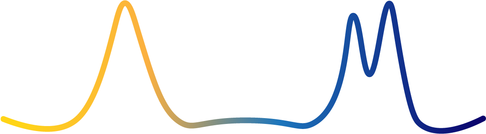

Moscot - Multiomics Single-cell Optimal Transport
=================================================

``moscot`` is a framework for optimal transport applications in single cell genomics.

.. image:: _static/img/light_mode_logo.png
    :width: 600px
    :align: center
    :class: only-light

If you find a model useful for your research, please consider citing the ``moscot`` manuscript (in preparation) as
well as the publication introducing the model, which can be found in the corresponding documentation.

.. grid:: 3
    :gutter: 1

    .. grid-item-card:: Installation
        :link: installation
        :link-type: doc

        Learn how to install ``moscot``.

    .. grid-item-card:: API
        :link: api/index
        :link-type: doc

        Find a detailed documentation of ``moscot``.

    .. grid-item-card:: Contributing
        :link: contributing
        :link-type: doc

        Add a functionality or report a bug.

    .. grid-item-card:: Examples
        :link: notebooks/examples/index
        :link-type: doc

        Find brief and concise examples of ``moscot``.

    .. grid-item-card:: Tutorials
        :link: notebooks/tutorials/index
        :link-type: doc

        Check out how to use ``moscot`` for data analysis.

    .. grid-item-card:: Manuscript

        Stay tuned, coming soon!

.. toctree::
    :maxdepth: 2
    :hidden:

    installation
    api/index
    contributing
    references

    notebooks/tutorials/index
    notebooks/examples/index
