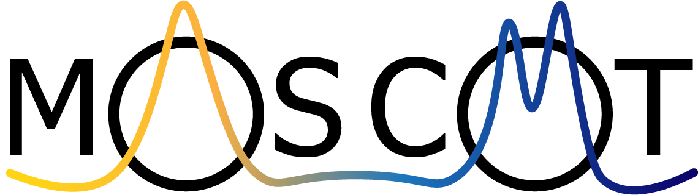

moscot - multiomics single-cell Optimal Transport
==================================================

``moscot`` is a framework for optimal transport applications in single cell genomics.

If you find a model useful for your research, please consider citing the ``moscot`` manuscript (in preparation) as
well as the publication introducing the model, which can be found in the corresponding documentation.

.. card:: Installation
    :link: installation
    :link-type: doc

    Learn how to install ``moscot``.

.. card:: API
    :link: api/index
    :link-type: doc

    Find a detailed documentation of ``moscot``.

.. card:: Examples
    :link: examples
    :link-type: doc

    Find brief and concise examples of certain functionalities of ``moscot``.

.. card:: Tutorials
    :link: tutorials
    :link-type: doc

    Check out how to use ``moscot`` for data analysis.

.. card:: Contributing
    :link: contributing
    :link-type: doc

    Add a functionality or report a bug.

.. card:: Github
    :link: https://github.com/theislab/moscot
    :link-type: url

    Click here to see the Github repository.

.. card:: Manuscript

    Stay tuned, coming soon!

.. toctree::
    :caption: General
    :maxdepth: 2
    :hidden:

    installation
    api/index
    contributing
    references

    tutorials
    examples

.. toctree::
    :caption: Gallery
    :maxdepth: 2
    :hidden:
